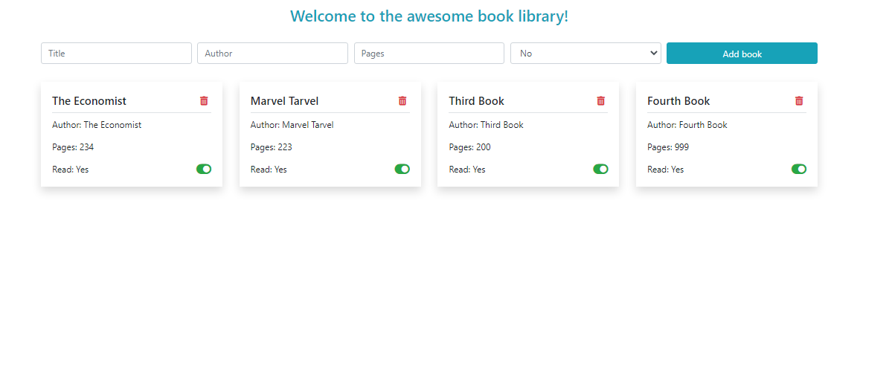

  

# Book Library where you can add book and toggle their read status..

> In this project, we were required to build a book library where everybody can add and delete books, and toggle their read status.
>  
> The app is mobile friendly and saves all books to firebase database.

## This web app is live, you can check it here: [Live demo](https://cristianceamatu.github.io/microverse-library/)

## Screenshots of the app.

## Built With

- HTML/CSS
- Bootstrap
- Javascript
- Firebase

## Prerequisities

To get this project up and running locally, you must follow the steps from the [getting started section](#getting-started).

## Getting Started

**To get this project set up on your local machine, follow these simple steps:**

**Step 1** 
Navigate through the local folder where you want to clone the repository and run 
`https://github.com/cristianCeamatu/microverse-library`. It will clone the repo to your local folder. 
or with https 
`https://github.com/cristianCeamatu/microverse-library.git`. 
**Step 2** 
Open the folder and double click on `index.html`

## Authors

👤 **Cristian Viorel Ceamatu**

- Github: [@cristianCeamatu](https://github.com/cristianCeamatu)
- Twitter: [@CeamatuV](https://twitter.com/CeamatuV)
- Linkedin: [Ceamatu Cristian](https://www.linkedin.com/in/ceamatu-cristian/)

## 🤝 Contributing

Our favourite contributions are those that help us improve the project, whether with a contribution, an issue, or a feature request!

## Show your support

If you've read this far....give us a ⭐️!

## 📝 License

This project is licensed by Microverse and the Odin Project
